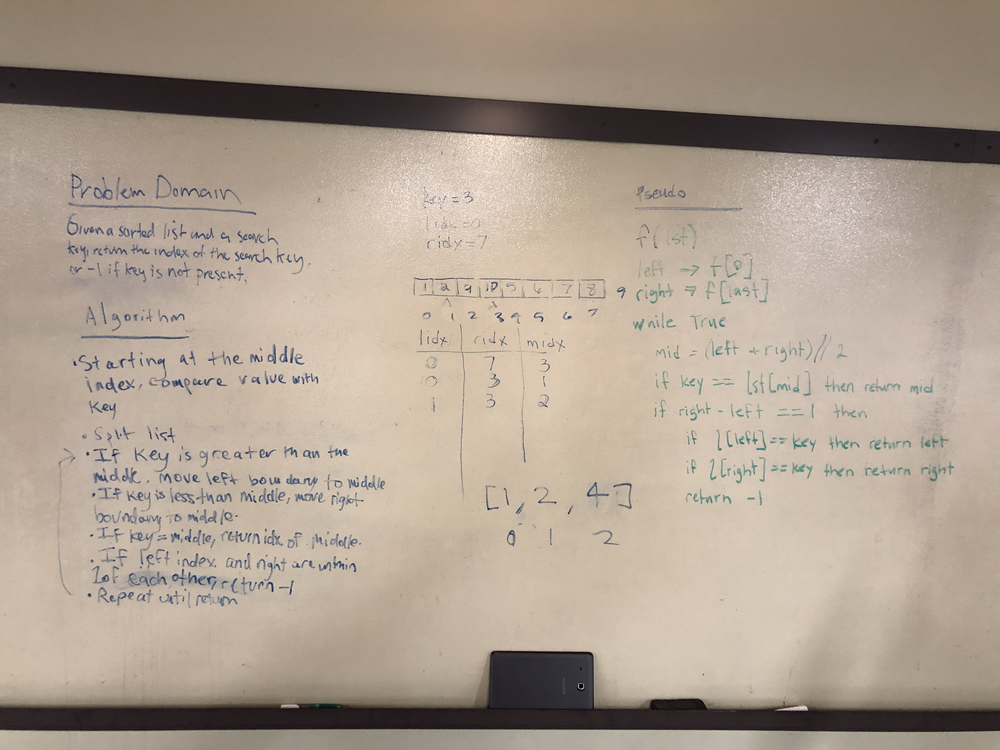

# Binary Search
Using Python, given a sorted list of arbitrary size and a key to be found, this module continually splits the list in half depending on whether the key is in the upper or lower half of the split until the desired key is found, returning the index to the key or -1 if the key is not found

## Challenge
This task must be accomplished without using any built-in list sorting or traversal functions and should be tested according to TDD

## Approach & Efficiency
Hannah, Scott and I took the approach of finding the middle index of the list, and then using a series of simple if statements in a while loop to determine whether the key exists in the list or not using the methodology above.

A recursive solution was kind of on the tip of my tongue/front of my brain, but I couldn't quite get to it. Regardless, the function runs in O(N/2), because at most the loop will traverse half of the total list indices.

## Solution

