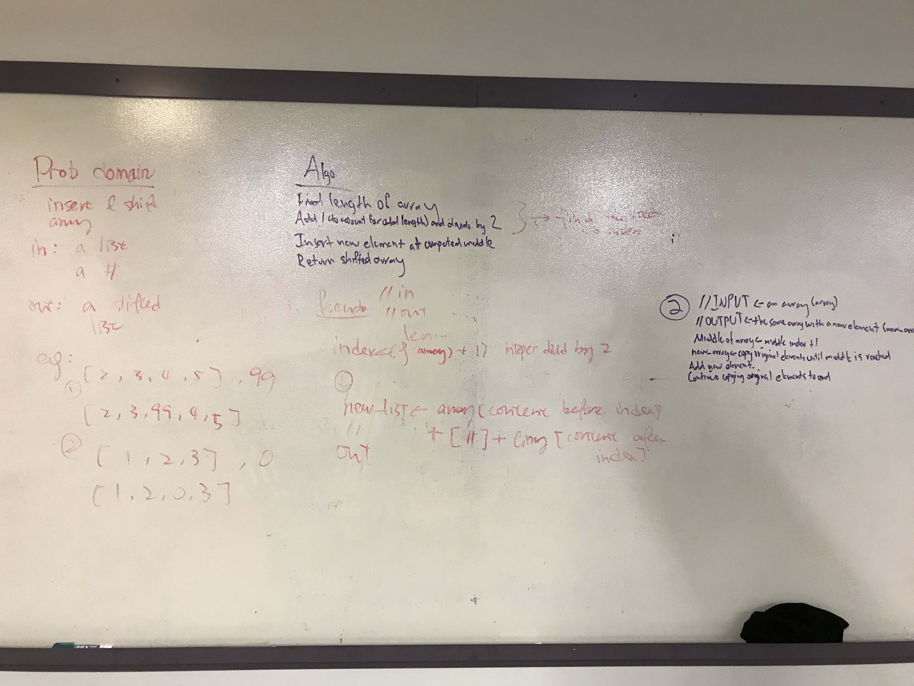

# Insert and shift middle index of array
Using Python, given a list of arbitrary size and an element to be added, this function inserts the desired element into the middle index of an odd array or index + 1 of an even array

## Challenge
This task must be accomplished without using any sort of built-in sorting method and should be tested according to TDD practices

## Approach & Efficiency
I took the approach of finding the middle index of the input list by using the len() function, adding 1 and doing integer division by 2, ensuring that I'd compute the middle index regardless of an odd or even number of indices.

To actually insert the new element, I used a simple for loop with a range of the length of the original list, with an if at the front to detect the middle index and insert the new element as desired. After the if, the loop appends each element from the original in the list to the new list. When the loop is finished, the function returns the new list.

I also accomplished the stretch goal using a similar method, but instead of appending the new element, I used an if to detect if the element being added to the new list was the one that should be removed, in which case I used a continue statement to bypass the addition of that element.

Both functions run in O(N), because space and runtime depend pretty explicitly on the size of the list.

## Solution

