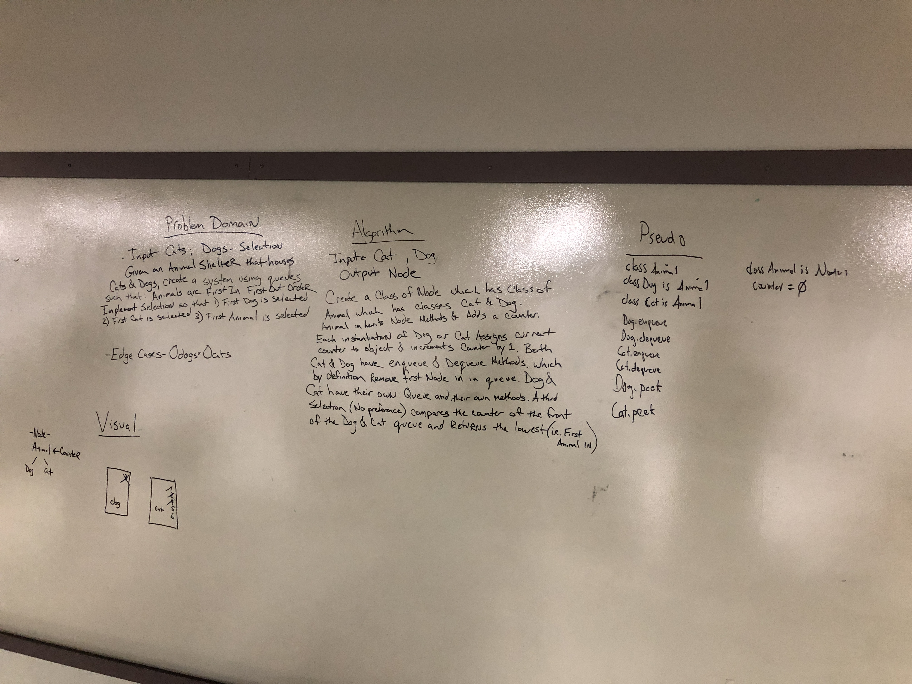

# First-in, First-out Animal Shelter.
Create a class called AnimalShelter which holds only dogs and cats, operating on a first-in, first-out approach.

## Challenge
Implement an enqueue(animal) method to add animal (dog or cat) to the shelter. Implement dequeue(pref) to return either a dog or cat. If pref is not "dog" or "cat", return null.

## Approach & Efficiency
Matt and I whiteboarded an approach to accommodate the challenge goal, creating a base animal class, inherited dog and cat classes, and two queues, one for dogs and one for cats. In theory, a counter on the animal class would have allowed for selection of the animal added least recently (i.e. the lowest value), but I decided to focus on the main task and abandoned the stretch goal.

Because the implementation is in the form of queues, the efficiency mirrors that of queues with limited conditionals that decide which queue to insert into.

## Solution

