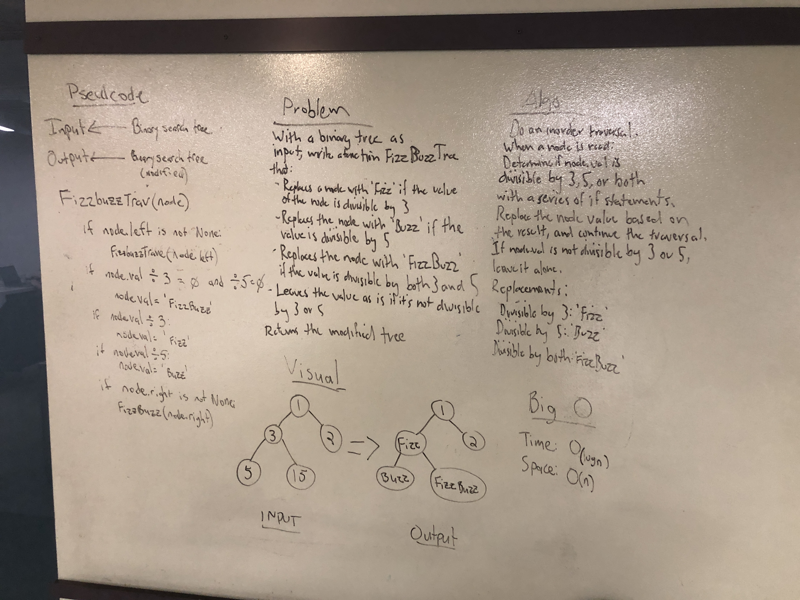

# FizzBuzz Tree
Implement FizzBuzz algorithm on a binary tree:
    - if the node in the tree is divisible by 3, change it to 'Fizz'
    - if the node in the tree is divisible by 5, change it to 'Buzz'
    - if the node in the tree is divisible by both 3 and 5, change it to 'FizzBuzz'

## Challenge
The new function may not use any built-in methods, must take a tree as input and return the same tree with modifications as output

## Approach & Efficiency
Ray and I built a "custom" inorder traversal to modify each node. I considered using the callback in my already built traversal, but it didn't work as expected. The time and space complexities are both O(N) because the whole tree is traversed in order to test for fizziness and/or buzziness

## Solution

