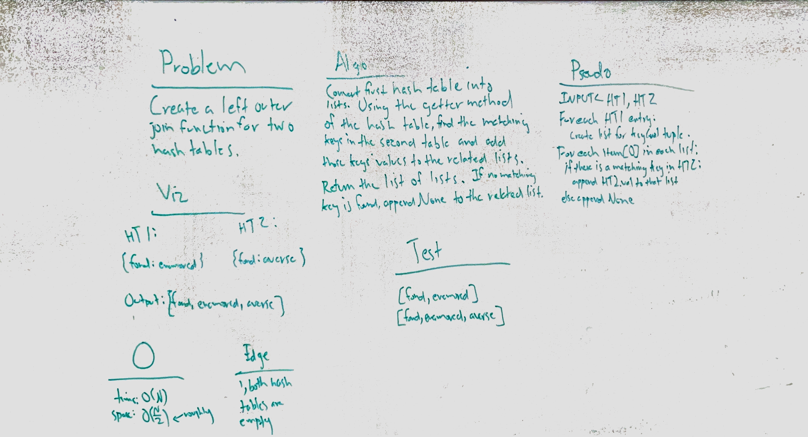

# Hashmap LEFT JOIN
Join two hash tables using left join principles.

## Challenge
Don't use any built-in methods or libraries.

## Approach & Efficiency
My approach was to walk the first hash table, dump the tuples of key/value pairs into lists, and then walk the second table to look for matches on the first table, adding the value of the match if found. Actually implementing it was fairly difficult, however, and in the end I settled on a rather insane series of loops to walk through each table, including a nested loop to walk through the list of lists generated during the first hash table traversal. It is... not efficient.

## Solution

