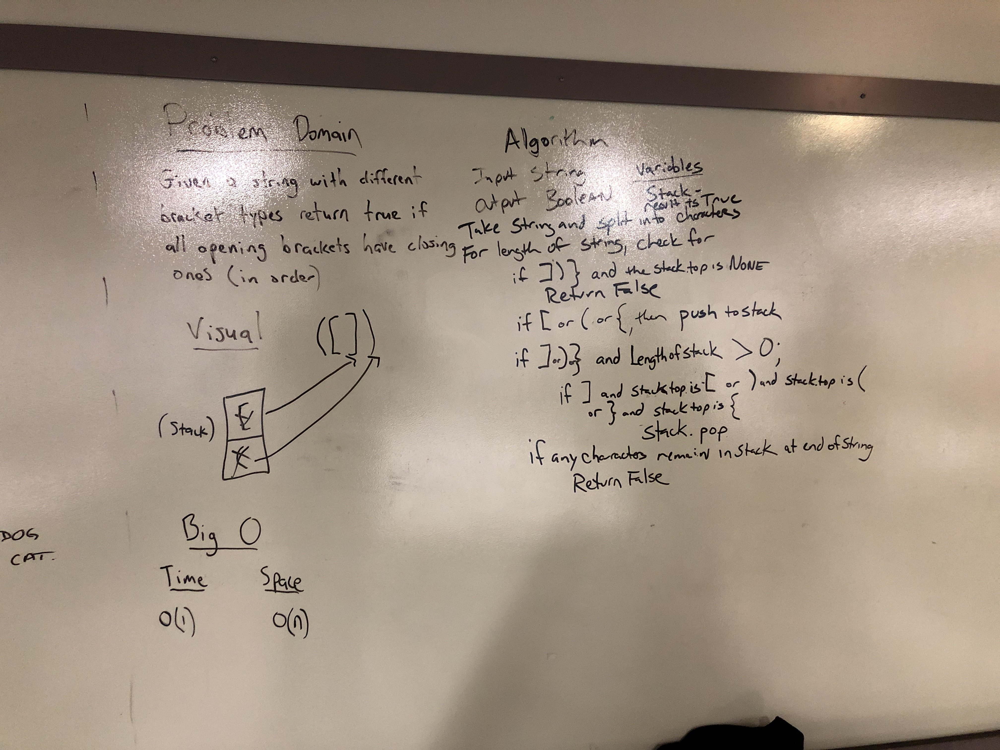

# Multi-bracket Validation.
Write a function that takes in a string as its only argument and returns a boolean representing whether the brackets in the string are balanced.

## Challenge
Ensure function works with all three types of brackets ((), [], {}) and that it allows for non-bracket characters between them.

## Approach & Efficiency
Matt, Ray and I pretty quickly realized that the best data structure to help with this task is a stack which holds opening brackets. Whenever a closing bracket is encountered, it's compared with the top item on the stack, because we're always looking for the most recent kind of bracket added. If the closing bracket matches the opening bracket in the stack, pop that item off the stack.

Using this idea, our original whiteboard solution called for splitting the string and then looping over the result, but I realized afterward that it would take less time and storage to simply traverse the string using the built-in str[] method with a loop that runs for the length of the string.

If the stack is empty when the string has been fully traversed, the function returns true, because all of the brackets have been matched. If there is anything left in the stack, return false, because there's a dangling bracket.

## Solution

