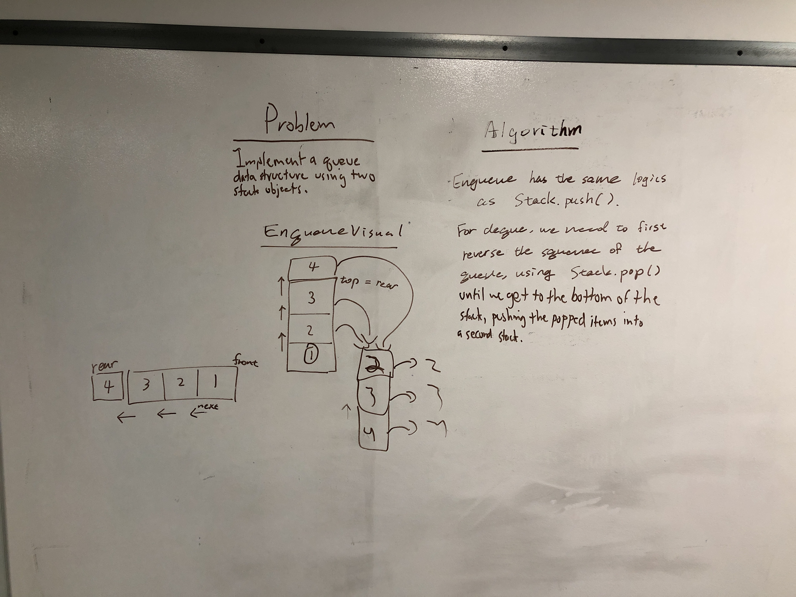

# Implement a Queue using two Stacks.
Create a brand new PseudoQueue class and implement a queue data structure using two previously defined Stack data structures.

## Challenge
Without adding to the stack data structure, implement enqueue and dequeue functionality.

## Approach & Efficiency
In class, JB gave us a hint to think about how a slinky works in the context of the challenge. With that in mind, Joyce and I considered how we could reverse a stack in order to dequeue in the reverse order that we enqueue, since all we can do is push an item on top of the stack.

Our solution involves using the second stack as a sort of temporary data structure, pouring the items in the queue into the second stack--reversing the order--, popping the top item off, and then replacing the rest of the items into their original stack.

Enqueueing is accomplished in O(1) time, because the new item is simply pushed on to the top of the stack. Dequeueing, however, takes O(2N) time, because for every item you dequeue, you have to traverse the entire list twice.

## Solution

