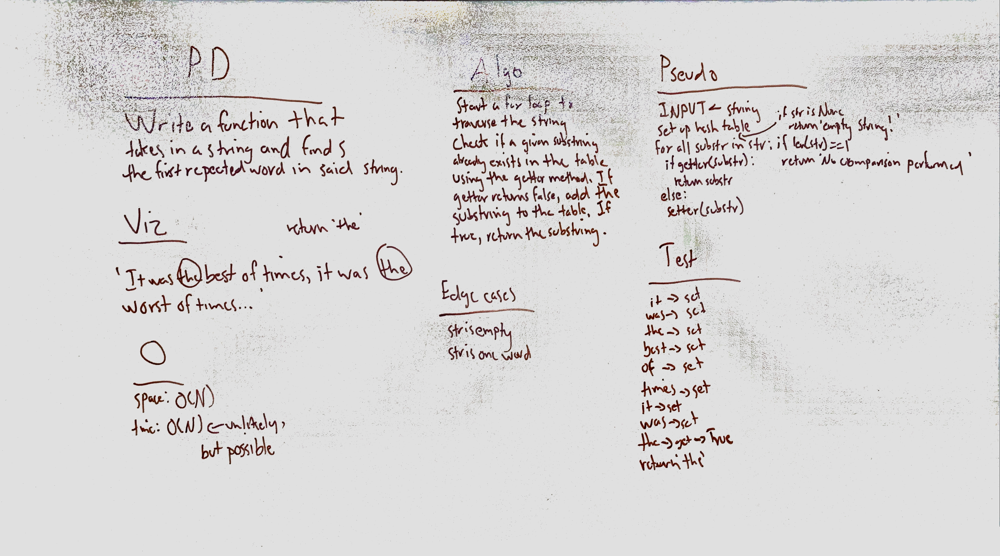

# First repeated word
Given an arbitrarily large input string, find the first repeated word in said string.

## Challenge
Don't use any built-in methods or libraries to accomplish this task.

## Approach & Efficiency
My approach was to split the string into words and then parse those words via string indexing, checking my hash table's getter method to see if the word is already in the hash table, and adding it via the setter method if not. Once a match is found, that match is returned. In terms of efficiency, this function requires O(N) space and up to O(N) time, though it's unliekly to reach the end of the string without finding a match.

## Solution

