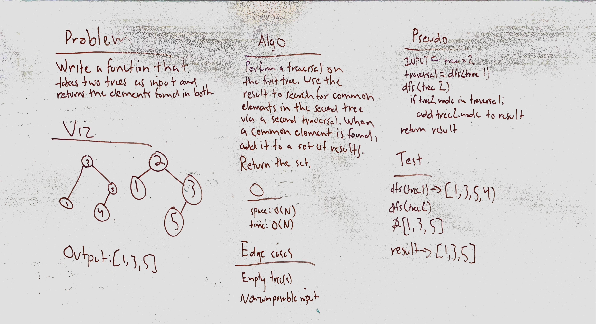

# Intersection of binary trees
Find the nodes that exist in both of two input trees.

## Challenge
Don't use any built-in methods to do so.

## Approach & Efficiency
My original approach called for using the "visit" part of my binary search tree implementation, but when I actually tried to write it, it became clear that I couldn't do so without rewriting the BST class and breaking the other helper functions. So, I used an already-written traversal to build a list of the nodes in the first tree and then rewrote the traversal within the larger function to test during the second tree traversal whether a node is in that first traversal list. If so, it gets added to a result set.

This basically takes O(N) time and space, though comparing each node against the original list traversal probably increases the time unnecessarily.

## Solution

