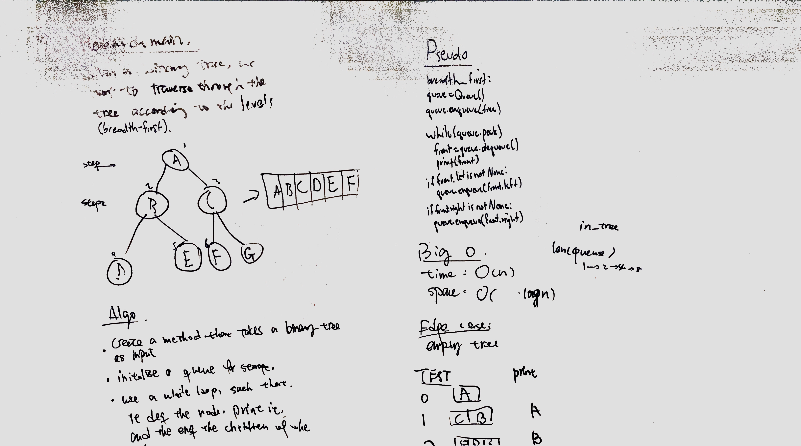
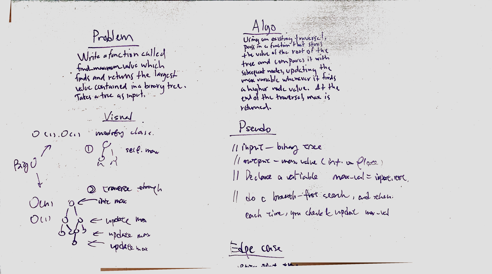

# Binary Search Tree

A basic implementation of a binary search tree data structure. It currently allows for instantiation, insertion, and pre-, in-, and post-order depth-first traversals, as well as a breadth-first traversal.

# Breadth-first
Write a breadth-first traversal method which takes a Binary Tree as its unique input.

## Challenge
Do not use any of the built-in methods available to your language.

## Approach & Efficiency
Toby and I basically followed the CF example implementation, using the Queue class we already built to enqueue and dequeue the nodes to enforce the breadth-first order.

The time complexity is O(N), since every node in the tree will be visited. The space complexity is O(log N) since a very full tree will require a lot of space at the bottom level, but progressively less space leading up to that bottom layer.

## Solution

# Find the Maximum Value in a Binary Tree
Write a function to find the maximum value in a binary tree.

## Challenge
Do not use any of the built-in methods available to your language.

## Approach & Efficiency
Toby and I discussed using a breadth-first search with a helper function that uses a series of if-statements to find the maximum value in the tree. Since it piggybacks on breadth-first search, it takes O(N) time, and occupies O(log N) space.

I also rewrote my BST class to generalize the traversals to be able to take in any function as a helper, as opposed to explicitly passing in the enlist function I previously wrote. I also realized that the code overall had variables being passed in that weren't necessary, so did a bit of cleanup on the class as a whole, thankfully without breaking anything.

## Solution

