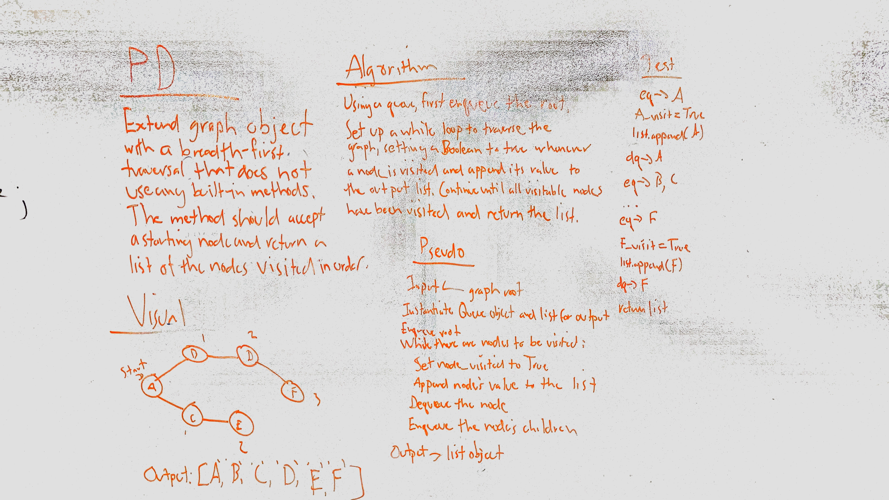

# Breadth-First Traversal of a Graph
Add a breadth-first traversal method to the previously built Graph implementation.

## Challenge
Do not use any built-in methods in implementing the traversal. Return a collection of the order in which the nodes were visited and display the collection.

## Approach & Efficiency
I basically adapted the approach outlined in the Graphs reading, except that instead of using a Boolean to determine whether a vertex has been visited, I used a list. I considered adding a Boolean to the data structure itself, but the assignment was to extend, not amend. As with most traversals, the time complexity is O(N) because I have to traverse the whole graph in order to figure out what's in it. Using a list to check whether a given node has been visited means that space complexity is also O(N).

## Solution

