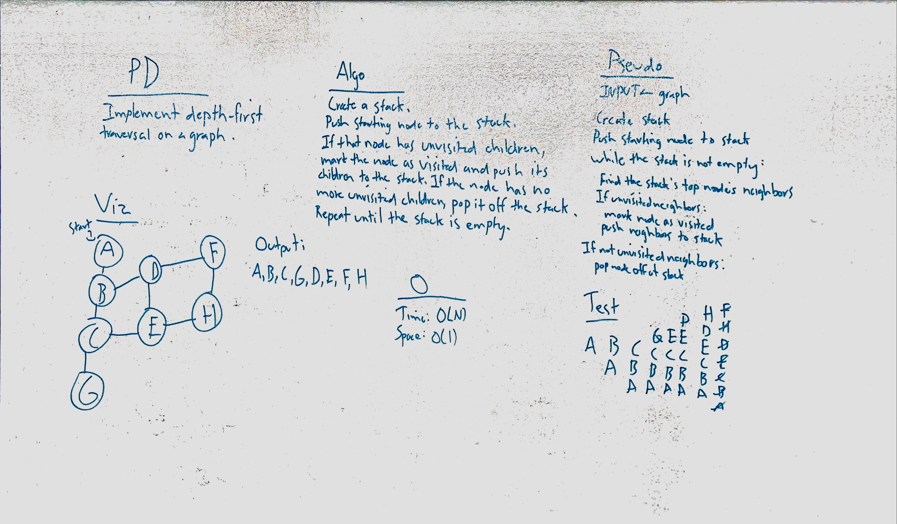

# Depth First Traversal
Write a function to perform a pre-order depth-first search on an existing graph, passed in as an adjacency list.

## Challenge
Do not use any built-in methods.

## Approach & Efficiency
Unfortunately, my whiteboarding and initial conception look nothing like my eventual solution. Creating an iterative solution that involved our existing Stack data structure proved extremely difficult, and ultimately counter-intuitive. Once I refactored to a recursive solution, the work was much more straightforward.

## Solution

