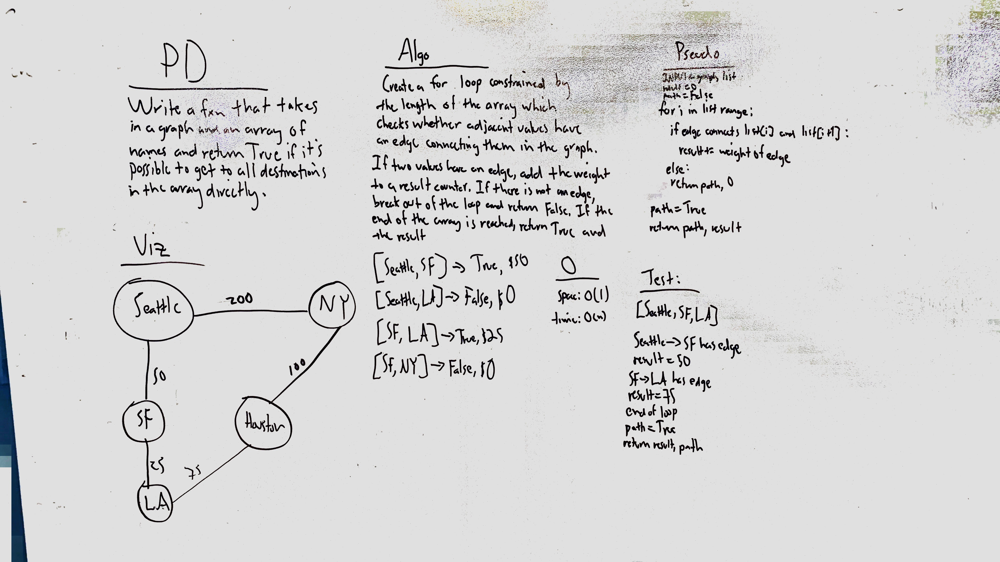

# Get Edges
Extend the Graph implementation to determine whether a path between a list of input vertices is possible, and if it is, return the total weight of the path; if not, return false with no weight.

## Challenge
The challenge uses a metaphor of cities and the cost to travel between them metaphor, and the output is framed accordingly. Don't use any built-in methods to accomplish the task.

## Approach & Efficiency
Since one of the inputs was a list, my approach was to use simple list traversal in order to determine whether each adjacent element in the list was also connected via an edge, using the get_neighbors function already written into the Graph implementation. Traversing the list to determine whether a route was possible takes O(N) time and O(1) space.

## Solution

