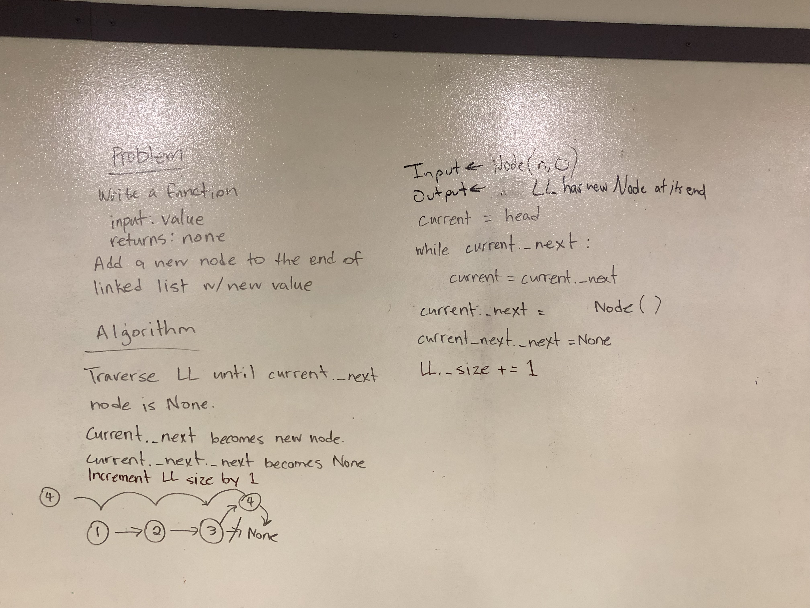
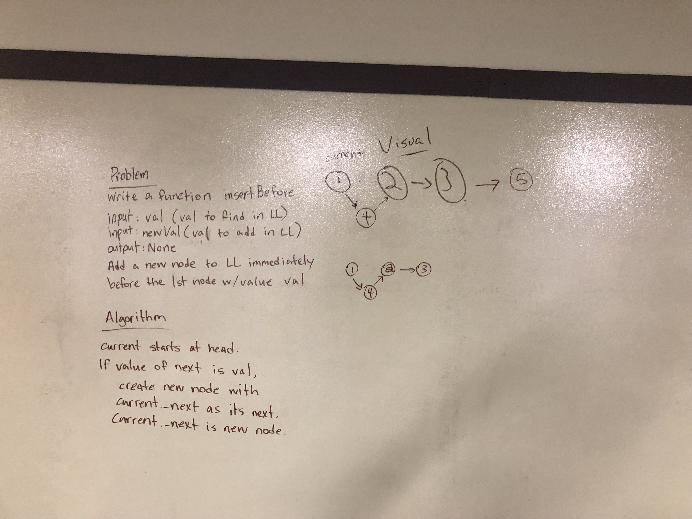

# Linked List Insertions
An expansion of a simple linked list module that allows for appending to the end of the list along with inserting before or after a desired node value.

## Challenge
This task must be accomplished by extending the predefined linked list and node classes, which include only limited node traversal and insertion.

## Approach & Efficiency
I thought I had a good handle on how to accomplish these tasks, but when I went to write insert_before, it turned out I wrote insert_after, and I ended up with an infinite loop when I tried to (re)write insert_before. It took a while to figure out what was going wrong, and if I'm being honest, I'm still not sure why the loop requires a return once the node is in place, but I plan to ask about it tomorrow. The return in insert_after was added after the fact for symmetry.

As with other linked list traversals, the append and insertions run in O(N) time, as traversal depends on the size of the list and will, at worst, will have to traverse the entire list before insertion.

## Solution

# kth from the end of a Linked List
An exercise to extend the existing linked list module that allows for finding the element at the kth node from the end of the list.

## Challenge
This task must be accomplished by extending the predefined linked list and node classes, and may not use the __len__ function.

## Approach & Efficiency
Joyce came up with the idea of using a lookahead variable to create an offset between the head of the list and the number of elements from the end we're looking for. Matt and I interrogated and refined the method to deal with edge cases and coalesce the concept into working code.

As usual, the runtime will be O(N), because even though the lookahead is found before the result is calculated, the lookahead variable will only ever do as many traversals as the size of the list because of how it's set in place.

## Solution

