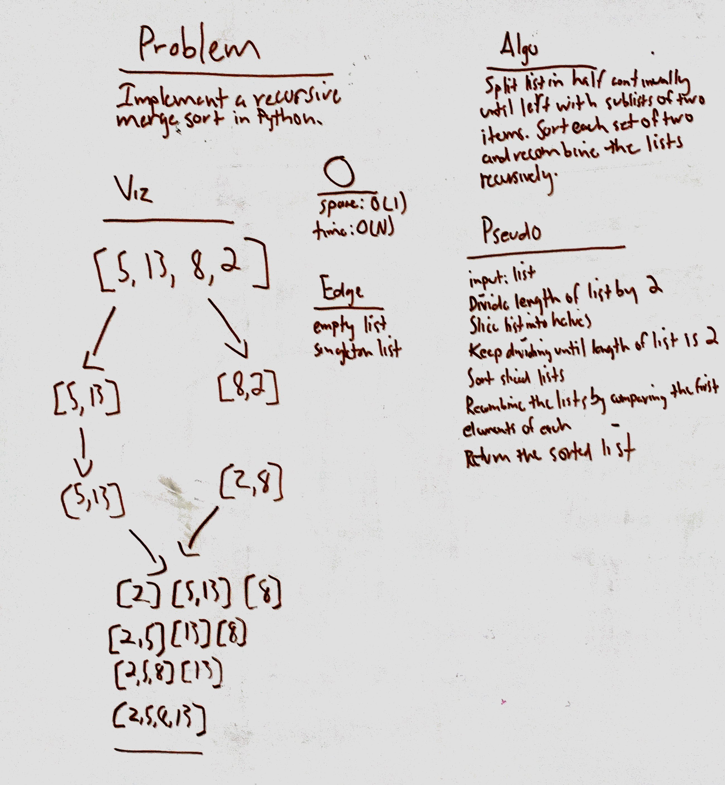

# Mergesort
Implement merge sort recursively using a list as input.

## Challenge
Do not use any built-in functions or methods to do so.

## Approach & Efficiency
The approach is... to use the merge sort algorithm, which requires O(N log N) runtime and O(N) space to complete.

## Solution

