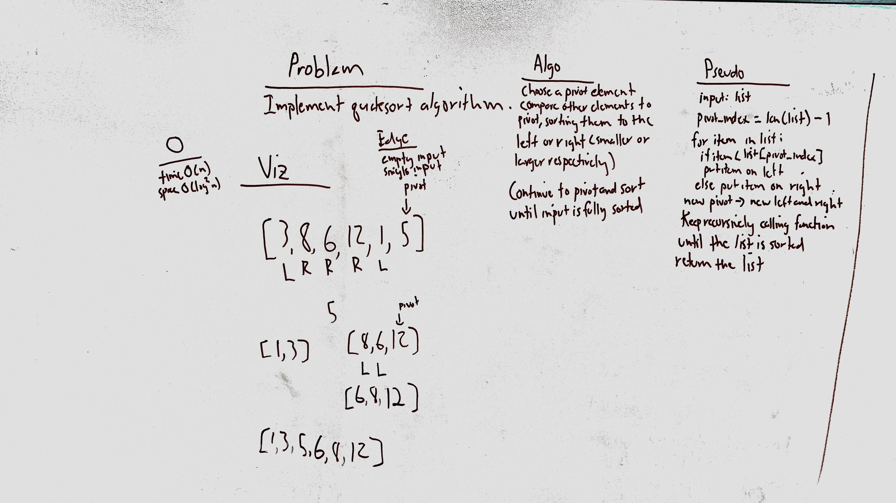

# Quicksort
Implement merge sort recursively using a list as input.

## Challenge
Do not use any built-in functions or methods to do so.

## Approach & Efficiency
The approach is... to use the quick sort algorithm, which generally requires O(N log N) runtime and space to complete, though (pathological) worst case scenarios exist which could cause it to climb to O(N2) time and O(N) space.

## Solution

