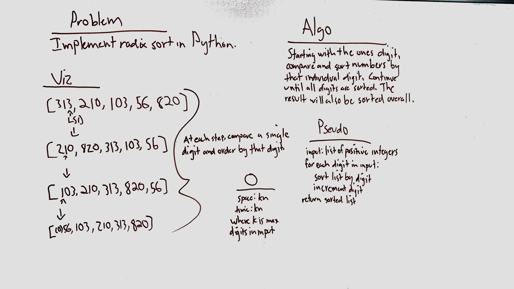

# Radix sort
Implement a radix sort in Python, assuming an input list of positive integers.

## Challenge
Do not use built-in methods or functions to do so.

## Approach & Efficiency
I used a least significant digit approach, with a helper counting sort function to sort the input by each digit, which takes O(kn) time and space.

## Solution

